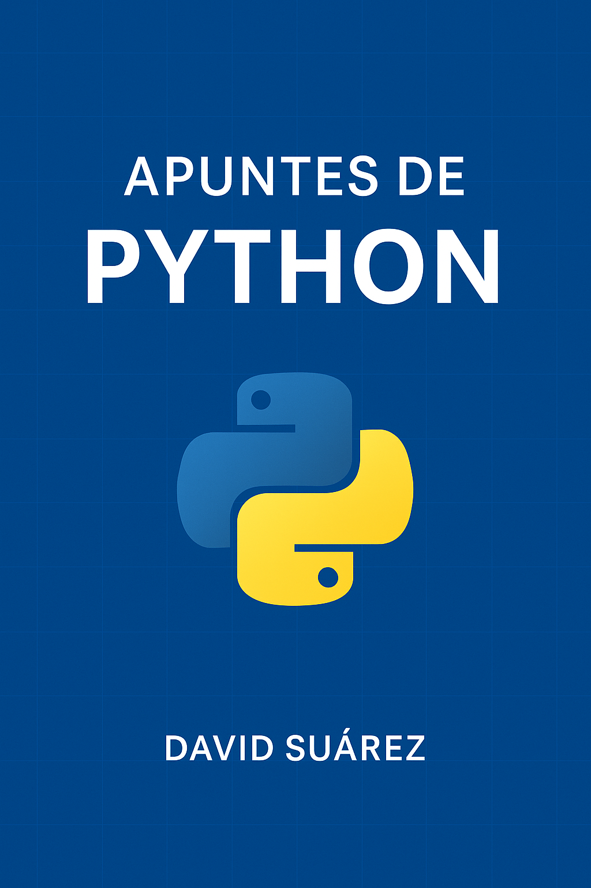

# 🐍 Mis Apuntes de Python

Este repositorio contiene un PDF con los apuntes que he ido tomando durante mi proceso de aprendizaje de Python, como principiante autodidacta. Están organizados por temas y pensados para facilitar la comprensión paso a paso.

📄 **[Descargar apuntes en PDF](./apuntes-Python.pdf)**

---

## 🧠 Contenido

- Variables y tipos de datos  
- Condicionales y bucles  
- Funciones  
- Listas, diccionarios y tuplas  
- Manejo de archivos  
- Introducción a la Programación Orientada a Objetos  
- Ejercicios prácticos

---

## 🚀 Propósito

He creado este material como parte de mi formación y lo comparto con la comunidad para ayudar a otras personas que también están comenzando en el mundo de la programación.

---

📅 Última actualización: junio 2025  
✍️ Autor: David Suárez
